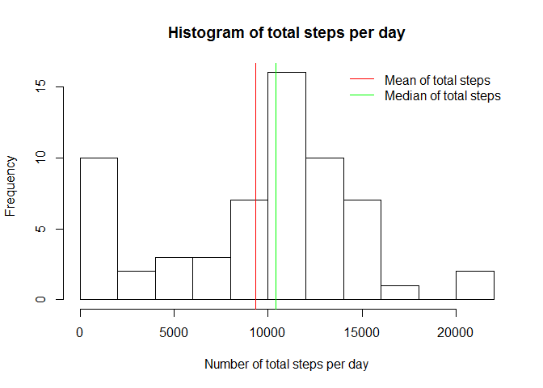
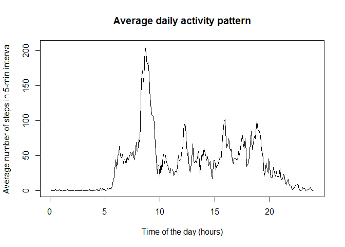
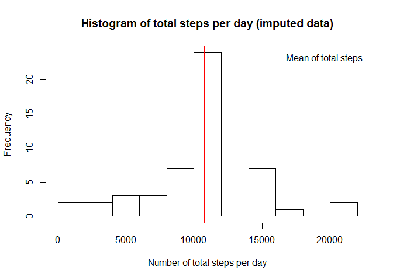
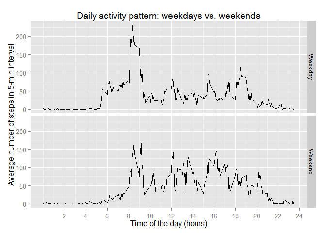

# Reproducible Research: Peer Assessment 1

Let's set up things first:


```r
library(knitr)
library(ggplot2)
opts_chunk$set(echo=TRUE)
```

## Loading and preprocessing the data

Data is included in the repo, so no need to download anything.
We'll simply read it into `data`.


```r
unzip(zipfile = "activity.zip")
data <- read.csv("activity.csv")
```

Let's get a quick glance at the data:


```r
str(data)
```

```
## 'data.frame':	17568 obs. of  3 variables:
##  $ steps   : int  NA NA NA NA NA NA NA NA NA NA ...
##  $ date    : Factor w/ 61 levels "2012-10-01","2012-10-02",..: 1 1 1 1 1 1 1 1 1 1 ...
##  $ interval: int  0 5 10 15 20 25 30 35 40 45 ...
```

```r
summary(data)
```

```
##      steps                date          interval     
##  Min.   :  0.00   2012-10-01:  288   Min.   :   0.0  
##  1st Qu.:  0.00   2012-10-02:  288   1st Qu.: 588.8  
##  Median :  0.00   2012-10-03:  288   Median :1177.5  
##  Mean   : 37.38   2012-10-04:  288   Mean   :1177.5  
##  3rd Qu.: 12.00   2012-10-05:  288   3rd Qu.:1766.2  
##  Max.   :806.00   2012-10-06:  288   Max.   :2355.0  
##  NA's   :2304     (Other)   :15840
```

We have 288 intervals each day (24 hours * 60 minutes / 5 minute intervals) and we have 61 days.

We also have lots of NAs and 0 values.
Intervals are in a format that represent the time of the day. `110` means `01:10`, 
`2335` means `23:35` etc.

## What is mean total number of steps taken per day?

We'll `tapply` the sum function over the steps of each day. 
Then look at the mean and median values. `NA`s will be ignored.


```r
steps <- tapply(data$steps, data$date, sum, na.rm = TRUE)
mean(steps)
```

```
## [1] 9354.23
```

```r
median(steps)
```

```
## [1] 10395
```

As expected, the mean is less then the median, due to the high number of missing and 0 values.

A histogram of the total steps distribution - a simple base plot will be enough this time.
We'll increase the default break number to 10, this way we get a better granularity.
Two `abline`s are also added to the historgram; mean and median to get a better 
look on the structure of the data.


```r
hist(steps, breaks=10, xlab="Number of total steps per day", ylab="Frequency", 
     main="Histogram of total steps per day")
abline(v = mean(steps), col="red")
abline(v = median(steps), col="green")
legend(x="topright", legend=c("Mean of total steps","Median of total steps"), 
       col=c("red","green"), bty="n", lwd=1)
```

 

As expected, mean and median are quite close to each other and both are around the middle of the range. 
However, the distribution is not that close to a normal distribution.

## What is the average daily activity pattern?

This time, we'll `tapply` the mean function on the steps over the (5-minute) intervals.
`NA`s will be ignored this time also.

In order to have the hours on the X axis' labels, we pass `1:288/288*24` as the x value.
This will result in `15` instead of `1500` in the case of 3PM 
(we have to pass the same amount of data points as to the y value, that's why `1:24` won't be good).


```r
avg <- tapply(data$steps, data$interval, mean, na.rm = TRUE)
plot(1:288/288*24, avg, type="l", xlab="Time of the day (hours)", 
     ylab="Average number of steps in 5-min interval",
     main="Average daily activity pattern")
```

 

The result seems to be reasonable: not many steps after 11PM and before 6AM and 
many steps around 9AM.

Then we'll find the 5-min interval in which the maximum step number occurs.


```r
avg[which.max(avg)]
```

```
##      835 
## 206.1698
```

This tells us that the largest average step number is `206.1698` and occurs on `8:35AM`.

## Imputing missing values

First, check the number of missing values:


```r
sum(is.na(data$steps))
```

```
## [1] 2304
```

The same, as we've seen before when looking at the `summary`.

A simple imputation technique is to insert the mean value of the rest of the 
other observations into the missing point. See [this][wiki] Wikipedia article, for example.

We'll create a new data set, `imputed`, that will use the previuos `steps` and `avg`.
If there is data, the data point will be taken from `steps` and if `NA`, 
it will be taken from `avg`.


```r
imputed <- transform(data, steps=ifelse(is.na(steps), avg, steps))
summary(imputed)
```

```
##      steps                date          interval     
##  Min.   :  0.00   2012-10-01:  288   Min.   :   0.0  
##  1st Qu.:  0.00   2012-10-02:  288   1st Qu.: 588.8  
##  Median :  0.00   2012-10-03:  288   Median :1177.5  
##  Mean   : 37.38   2012-10-04:  288   Mean   :1177.5  
##  3rd Qu.: 27.00   2012-10-05:  288   3rd Qu.:1766.2  
##  Max.   :806.00   2012-10-06:  288   Max.   :2355.0  
##                   (Other)   :15840
```

The `NA`s desappeared but the structure of data did not change significally; mean and median stayed the same.

As before with `steps`, `imputedsteps` will contain the mean total number of steps on a day.


```r
imputedsteps <- tapply(imputed$steps, imputed$date, sum, na.rm = TRUE)
mean(imputedsteps)
```

```
## [1] 10766.19
```

```r
median(imputedsteps)
```

```
## [1] 10766.19
```

Both mean and median increased. And due to the mean imputation now the mean value also the median value.

Now we'll look at the same histogram as we did before, with the imputed data. 
Since mean and median are the same, only the mean is displayed this time.


```r
hist(imputedsteps, breaks=10, xlab="Number of total steps per day", ylab="Frequency", 
     main="Histogram of total steps per day (imputed data)")
abline(v = mean(imputedsteps), col="red")
legend(x = "topright", legend = c("Mean of total steps"), col = c("red"),
       bty = "n", lwd = 1)
```

 

Clearly visible that the missing values disappeared and got replaced with the mean value.

## Are there differences in activity patterns between weekdays and weekends?

To answer this, we have to introduce a factor variable into our data that tells us 
whether that measurement occured on a weekday or on weekend. Later, we'll visualize 
the data separated by this factor variable.

First, convert the date field into actual POSIX date object. Then save which day 
these dates belong to.


```r
weekdays <- weekdays(as.Date(imputed$date))
```

Now, `weekdays` is a list of days. We'll check whether those days are weekend days 
using `%in%`. The result will be saved in the fourth column of `imputed`.

Instead of saving `TRUE` and `FALSE`, we'll save `"Weekend"` and `"Weekday"` using 
`ifelse` - this will help us with labeling later.

<sub>*Please note that RStudioo uses the default system locale, which is 
Hungarian in my case (days' names appear accordingly, in Hungarian). I've included 
an `if` conditional so this code runs both on my machine and on machines with English locale.*</sub>


```r
if (Sys.getlocale(category = "LC_TIME") == "Hungarian_Hungary.1250") {
  imputed[4] <- ifelse(weekdays %in% c("szombat", "vasárnap"), "Weekend", "Weekday")
} else {
  imputed[4] <- ifelse(weekdays %in% c("Saturday", "Sunday"), "Weekend", "Weekday")
}
colnames(imputed)[4] <- "weekend"
head(imputed)
```

```
##       steps       date interval weekend
## 1 1.7169811 2012-10-01        0 Weekday
## 2 0.3396226 2012-10-01        5 Weekday
## 3 0.1320755 2012-10-01       10 Weekday
## 4 0.1509434 2012-10-01       15 Weekday
## 5 0.0754717 2012-10-01       20 Weekday
## 6 2.0943396 2012-10-01       25 Weekday
```

In the last step, we'll calculate the mean of the steps over the (5-minute) intervals, 
but separated into weekends and weekdays. We'll split the data using `aggregate` 
then we'll visualize it using `ggplot2`.

Using `scale_x_continuous(breaks=c(1:12)*200, labels=paste(c(1:12)*2, sep="")` 
will scale our X axis to an appropriate format that displays actual hour numbers 
instead of the original walues. It vill add 12 break lines to every second hour 
(in the original format: 200, 400, 600, etc.) and will replace the tick labels 
with the correct hour values (2, 4, 6, etc.) converted to string using `paste`.


```r
imputedavg <- aggregate(steps ~ interval + weekend, data = imputed, mean)
head(imputedavg)
```

```
##   interval weekend      steps
## 1        0 Weekday 2.25115304
## 2        5 Weekday 0.44528302
## 3       10 Weekday 0.17316562
## 4       15 Weekday 0.19790356
## 5       20 Weekday 0.09895178
## 6       25 Weekday 1.59035639
```

```r
ggplot(imputedavg, aes(interval, steps)) + geom_line() +
       facet_grid(weekend ~ .) +
       labs(y="Average number of steps in 5-min interval") +
       labs(x="Time of the day (hours)") +
       labs(title="Daily activity pattern: weekdays vs. weekends") + 
       scale_x_continuous(breaks=c(1:12)*200, labels=paste(c(1:12)*2, sep=""))
```

 

The plot shows a clear difference between the steps frequency on a weekend and a weekday. 
According to this data, on weekends people tend to have fewer steps in the morning but the
step count is more evenly distributed during a weekend day. Also, "rush our" peaks 
during weekdays are visible, around 9AM and 6PM.

[wiki]:http://en.wikipedia.org/wiki/Imputation_%28statistics%29
